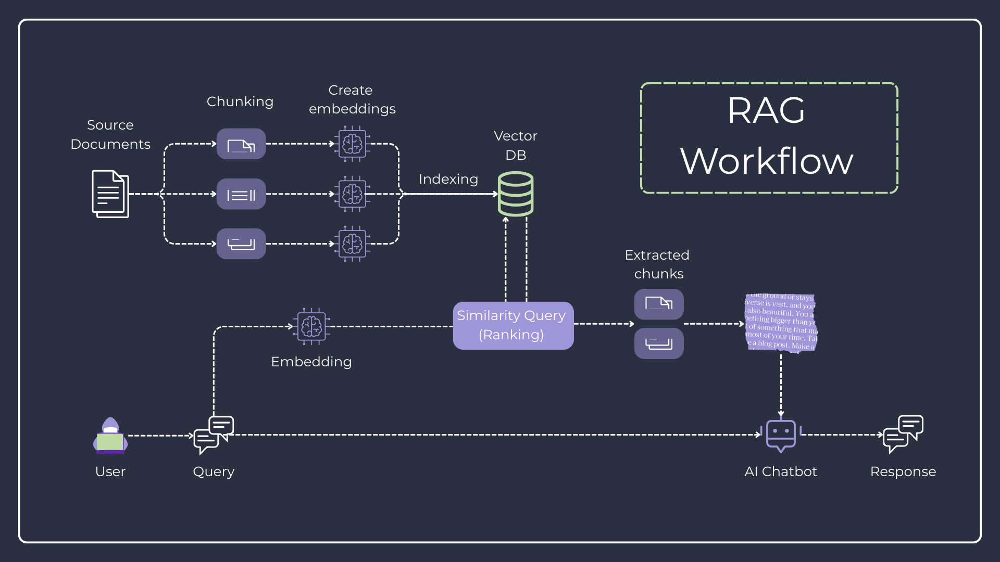

# Ultimate Advisor - RAG-Powered Q&A System

A production-ready **Retrieval-Augmented Generation (RAG)** application built with FastAPI, LlamaIndex, ChromaDB, and SQLite. Provides an AI-powered Q&A system using state-of-the-art language models.

**100% Windows Native** - No Docker required, runs directly on Windows 11.



## Features

- **Intelligent Document Processing**: Automatically chunks and indexes PDF documents
- **AI-Powered Q&A**: Natural language queries with context-aware responses
- **Source Attribution**: Every answer includes relevant source documents with scores
- **Query History**: Track all queries and responses in SQLite database
- **Local Storage**: All data stored locally (ChromaDB vectors + SQLite history)
- **Modern UI**: React 19 + TailwindCSS frontend with real-time updates

## Technology Stack

### Backend
- **FastAPI** - High-performance Python web framework
- **LlamaIndex** - RAG framework for document processing
- **ChromaDB** - Vector database with HNSW indexing
- **SQLite** - Query history and metadata storage
- **Anthropic Claude** - LLM for response generation
- **VoyageAI** - Embeddings (200M free tokens included)

### Frontend
- **React 19** - Modern UI framework
- **Vite** - Fast build tooling
- **TailwindCSS 4** - Utility-first CSS
- **TypeScript** - Type-safe development

## Quick Start

### Prerequisites

- Python 3.12+
- [Anthropic API Key](https://console.anthropic.com/)
- [VoyageAI API Key](https://www.voyageai.com/)
- Windows 11 (Native development)

### Installation

1. **Clone the repository**
   ```bash
   git clone https://github.com/yourusername/RagUltimateAdvisor.git
   cd RagUltimateAdvisor
   ```

2. **Install UV package manager**
   ```bash
   powershell -c "irm https://astral.sh/uv/install.ps1 | iex"
   ```

3. **Set up environment**
   ```bash
   # Install dependencies
   uv sync

   # Copy environment template
   copy .env.example .env
   ```

4. **Configure API keys**

   Edit `.env` with your keys:
   ```env
   APP_ANTHROPIC_API_KEY=your_key_here
   APP_VOYAGE_API_KEY=your_key_here
   ```

5. **Initialize database**
   ```bash
   uv run python src/scripts/run_init_db.py
   ```

6. **Add documents**

   Place PDF files in the `data/` directory

7. **Index documents**
   ```bash
   uv run python src/scripts/run_load_embeddings.py
   ```

8. **Start the application**
   ```bash
   uv run fastapi dev src/main.py --host 0.0.0.0 --port 8000
   ```

9. **Access the application**
   - Web UI: http://localhost:8000
   - API Docs: http://localhost:8000/docs

## Project Structure

```
RagUltimateAdvisor/
├── src/                    # Backend source code
│   ├── rag/               # RAG module (ChromaDB, LlamaIndex)
│   ├── history/           # Query history module (SQLite)
│   └── scripts/           # Utility scripts
├── frontend/              # React frontend
│   ├── src/              # React source code
│   └── dist/             # Production build
├── docs/                  # Documentation
│   ├── ARCHITECTURE.md   # System architecture
│   ├── API.md           # API documentation
│   ├── SETUP.md         # Detailed setup guide
│   └── ENVIRONMENT.md   # Configuration reference
├── tests/                 # Test suite
└── data/                  # Document storage
```

## Documentation

- [Architecture Overview](docs/ARCHITECTURE.md)
- [API Documentation](docs/API.md)
- [Setup Guide](docs/SETUP.md)
- [Environment Configuration](docs/ENVIRONMENT.md)
- [Embedding Models Guide](docs/EMBEDDING_MODELS.md)
- [Contributing Guidelines](CONTRIBUTING.md)

## Usage Examples

### API Usage

```python
import requests

# Submit a query
response = requests.post(
    "http://localhost:8000/api/rag/query",
    json={"query": "What is RAG?", "top_k": 5}
)

result = response.json()
print(f"Answer: {result['response']}")
print(f"Sources: {len(result['source_documents'])} documents")
```

### Query Examples

- Technical questions about your documents
- Conceptual explanations
- Specific information retrieval
- Multi-document synthesis

## Development

### Running Tests
```bash
uv run pytest
```

### Code Quality
```bash
# Format code
uv run ruff format .

# Lint code
uv run ruff check --fix .
```

### Frontend Development
```bash
cd frontend
pnpm install
pnpm dev
```

## Configuration

Key environment variables:

- `APP_ANTHROPIC_API_KEY` - Claude API key
- `APP_VOYAGE_API_KEY` - VoyageAI API key
- `APP_ANTHROPIC_MODEL` - LLM model (default: claude-sonnet-4-0)
- `APP_VOYAGE_MODEL` - Embedding model (default: voyage-3.5)
- `APP_CHROMA_PERSIST_DIRECTORY` - Vector storage location
- `APP_HISTORY_DB_PATH` - SQLite database path

See [Environment Configuration](docs/ENVIRONMENT.md) for complete reference.

## Performance

- **Indexing Speed**: ~100 pages/minute
- **Query Response**: <2 seconds average
- **Vector Search**: O(log N) with HNSW algorithm
- **Storage**: ~4MB per 1000 document chunks

## Cost Estimation

### VoyageAI Embeddings
- **Free Tier**: 200 million tokens
- **Cost**: $0.06 per million tokens after free tier
- **Example**: 100-page PDF ≈ 50,000 tokens ≈ $0.003

### Anthropic Claude
- **Pricing**: Pay-as-you-go
- **Example**: ~$0.003 per query (claude-sonnet-4-0)

## Troubleshooting

See [Setup Guide](docs/SETUP.md#common-issues) for solutions to common problems:
- API key configuration
- Database initialization
- Document indexing
- Port conflicts

## Contributing

We welcome contributions! Please see [CONTRIBUTING.md](CONTRIBUTING.md) for guidelines.

### Areas for Contribution
- Additional document loaders
- Performance optimizations
- UI/UX improvements
- Test coverage
- Documentation

## License

MIT License - see LICENSE file for details

## Support

- **Issues**: [GitHub Issues](https://github.com/yourusername/RagUltimateAdvisor/issues)
- **Discussions**: [GitHub Discussions](https://github.com/yourusername/RagUltimateAdvisor/discussions)
- **Documentation**: [docs/](docs/)

## Acknowledgments

- LlamaIndex team for the excellent RAG framework
- ChromaDB for efficient vector storage
- Anthropic and VoyageAI for powerful AI models
- FastAPI for the modern Python web framework

---

**Star this repository** if you find it helpful!