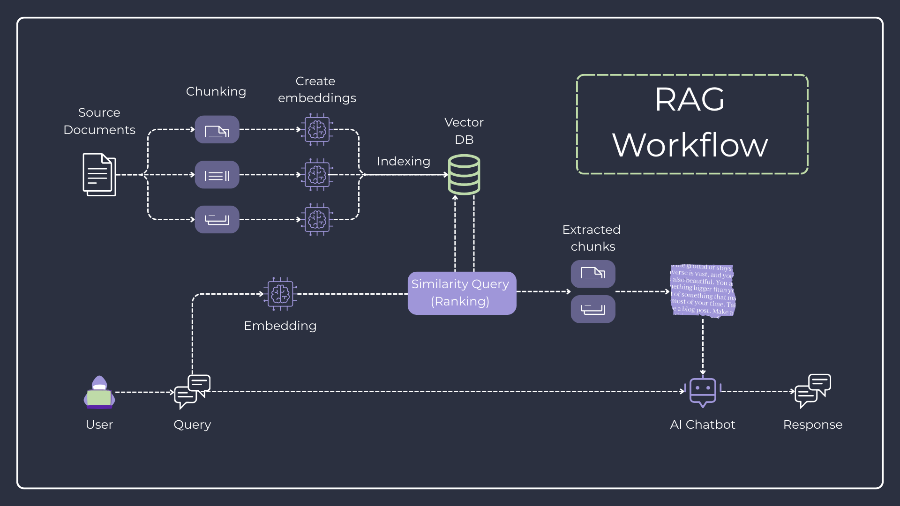

# Architecture Documentation

## Overview

Ultimate Advisor is a production-ready Retrieval-Augmented Generation (RAG) application that provides an AI-powered Q&A system using state-of-the-art AI models.

## System Architecture



## Module Structure

The codebase follows a layered architecture pattern with clear separation of concerns:

```
src/
├── main.py                     # FastAPI app entry point, SPA serving, logging
├── config.py                   # Settings (Pydantic BaseSettings with APP_ prefix)
├── dependencies.py             # Dependency injection for services
├── schemas.py                  # Shared Pydantic models
├── rag/                        # RAG module
│   ├── services.py            # Business logic (query, indexing)
│   ├── repositories.py        # Data access (ChromaDB, LLM setup)
│   └── routes.py              # API endpoints
└── history/                    # Query history tracking module
    ├── services.py            # History business logic
    ├── repositories.py        # SQLite database operations
    ├── models.py              # SQLModel tables
    ├── schemas.py             # Pydantic response models
    └── routes.py              # API endpoints
```

## Key Components

### RAGRepository (src/rag/repositories.py)
- **Initialization**: Sets up Anthropic Claude + VoyageAI embeddings, ChromaDB persistent client
- **ChromaDB Client**: Uses `PersistentClient` to store vectors locally in `storage/vectors/chroma/` directory
- **Embedding Dimension**: Auto-detects embedding model output dimension (VoyageAI: 1024 dims)
- **Document Indexing**: Uses `SentenceSplitter` (chunk_size=256, overlap=20) optimized for small document collections
- **Query Processing**: Creates `VectorStoreIndex` from ChromaDB, retrieves top-K similar documents, generates responses via Claude
- **Collection**: Uses cosine similarity for vector search (HNSW algorithm)

### RAGService (src/rag/services.py)
- Orchestrates RAG operations between repository and history service
- Tracks query performance metrics (response time, success/failure)
- Handles document indexing from directories or document lists

### HistoryService (src/history/services.py)
- Persists query history, responses, source documents, and metadata to SQLite
- Provides query statistics (total queries, success rate, avg response time)

## Data Flow

1. **Query Processing**:
   - User submits query via REST API
   - RAGService receives and processes the query
   - RAGRepository performs vector search in ChromaDB
   - Retrieved documents are sent to Claude for response generation
   - Response and metadata are stored in SQLite via HistoryService

2. **Document Indexing**:
   - Documents are loaded from the `data/` directory
   - Text is chunked using SentenceSplitter
   - Chunks are embedded using VoyageAI
   - Embeddings are stored in ChromaDB with HNSW indexing

## Database Design

### Vector Store (ChromaDB)
- **Storage**: Local persistent storage in `storage/vectors/chroma/` directory
- **Algorithm**: HNSW (Hierarchical Navigable Small World) for efficient similarity search
- **Similarity Metric**: Cosine similarity
- **Collection Management**: Auto-created with `get_or_create_collection()`

### Query History (SQLite)
- **Storage**: Single file database (`storage/database/ultimate_advisor.db`)
- **Tables**:
  - `queries`: Stores query text, response, timestamp, and metadata
  - `sources`: Stores source documents for each query
- **Indexes**: Optimized for query retrieval and statistics

## Query Optimization

The query engine implements several optimizations:
- `similarity_top_k` multiplied by 2 (capped at 15) for retrieval
- `response_mode="tree_summarize"` for better context synthesis
- `similarity_cutoff=0.6` to filter low-relevance documents
- Only returns the user-requested `top_k` documents in response

## Dependency Injection Pattern

Services are created via `dependencies.py`:
- `get_rag_repository()` - Singleton-like repository instance
- `get_rag_service()` - Creates service with dependencies injected
- `get_history_service()` - History service factory

This pattern provides:
- Easy testing with mock dependencies
- Flexible implementation swapping
- Clear dependency management
- Better code maintainability

## Frontend Integration

The backend serves a React SPA with the following configuration:
- Production build: `frontend/dist/` mounted at root
- Assets: `/assets` serves `frontend/dist/assets`
- SPA routing: All non-API routes fall back to `index.html`
- CORS: Configured for localhost:3000 and localhost:5173

## Logging Strategy

- **Log Directory**: `logs/server_logs/{timestamp}.log`
- **Middleware**: Request/response logging for all HTTP traffic
- **Module Loggers**: Distributed throughout codebase for granular debugging
- **Log Levels**: Configurable via environment variables

## Performance Considerations

1. **Vector Search**: HNSW algorithm provides O(log N) search complexity
2. **Embedding Cache**: ChromaDB persists embeddings to avoid re-computation
3. **Database Connection Pooling**: SQLite with connection management
4. **Async Operations**: FastAPI's async support for concurrent requests
5. **Chunking Strategy**: Optimized chunk size (256 tokens) for balance between context and precision

## Security Considerations

1. **API Keys**: Stored in environment variables, never in code
2. **Input Validation**: Pydantic models for all API inputs
3. **SQL Injection Prevention**: SQLModel ORM with parameterized queries
4. **CORS Configuration**: Restricted to specific origins
5. **File Access**: Limited to designated `data/` directory